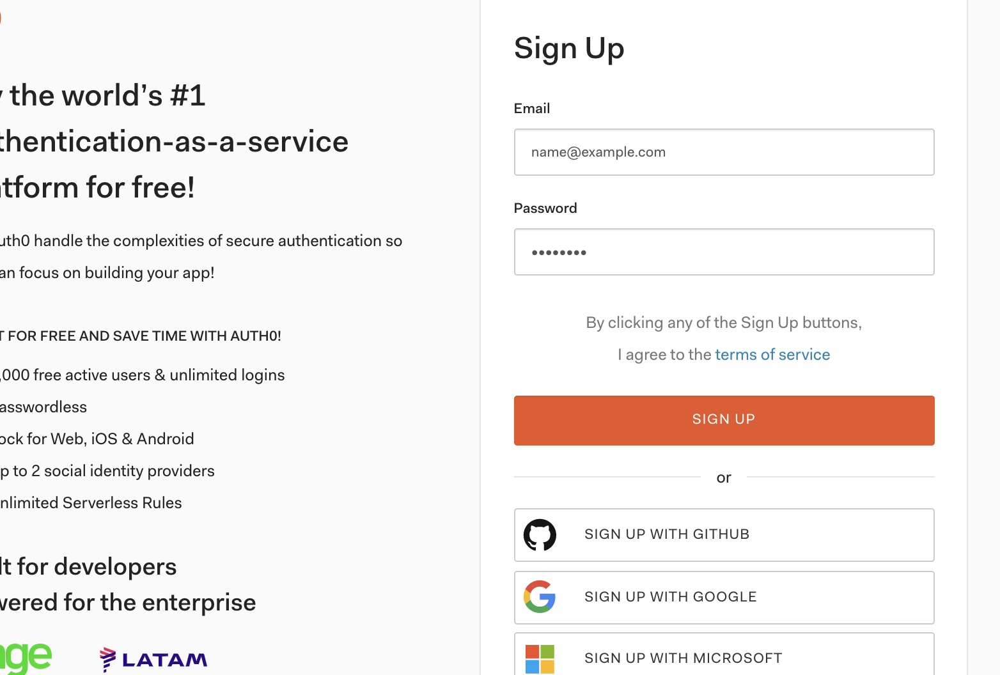
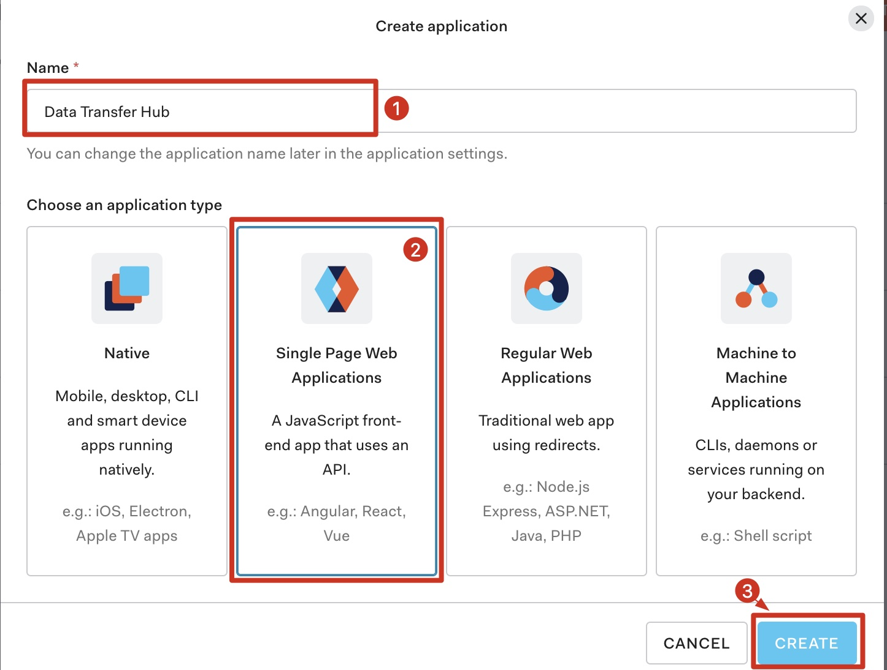
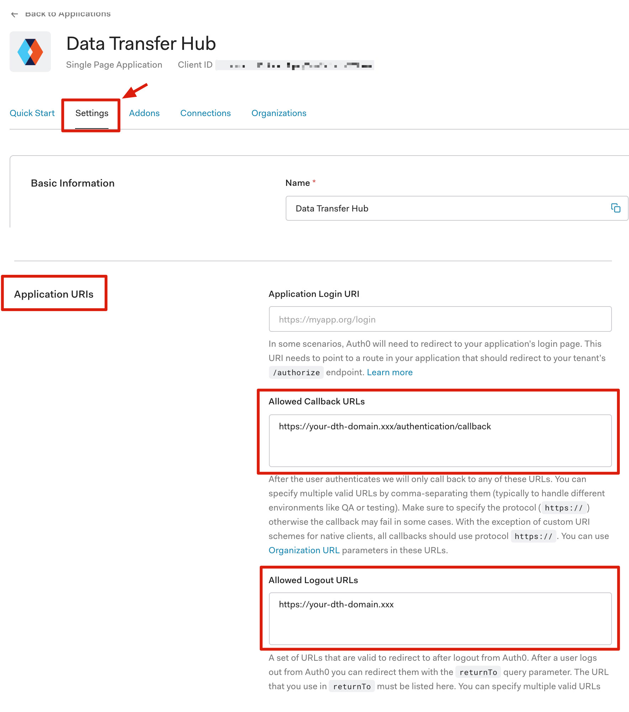
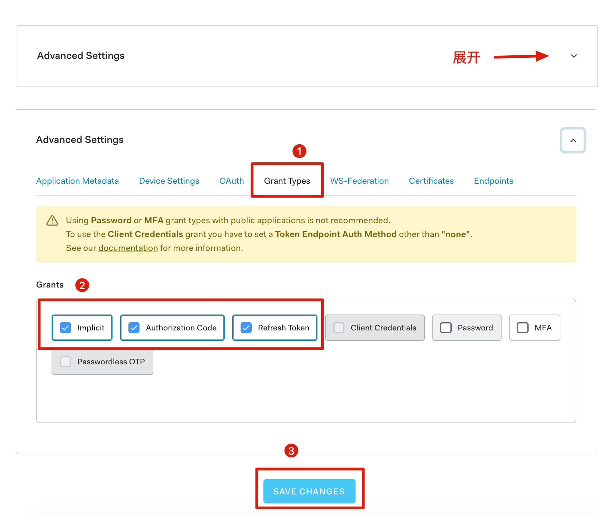
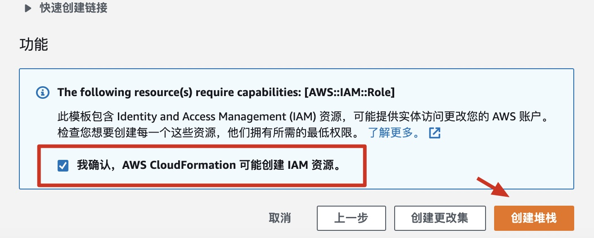
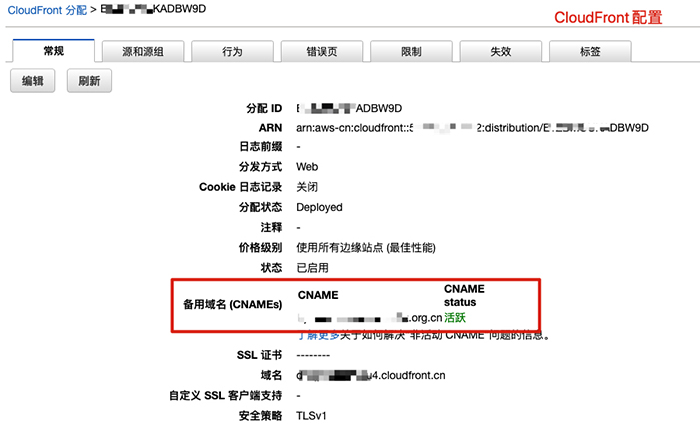
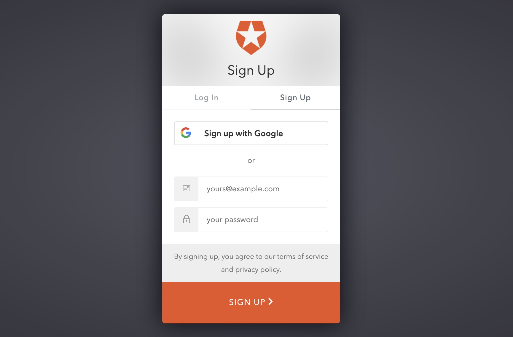
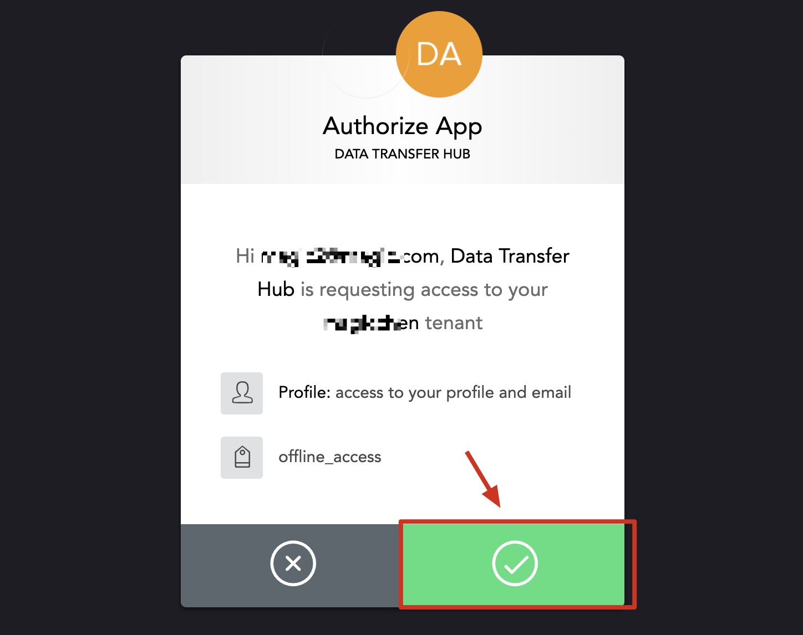
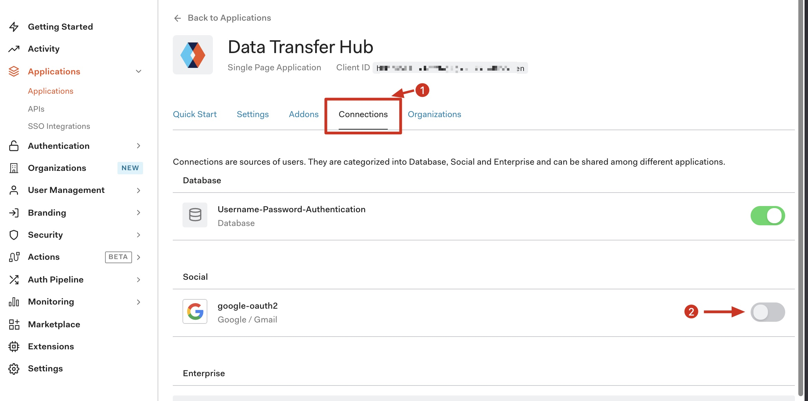
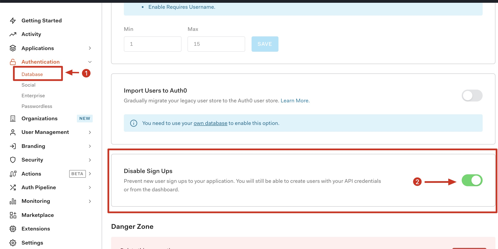

## 使用Auth0作为认证方式部署Data Transfer Hub

本文介绍的是使用Auth0作为认证方式部署Data Transfer Hub

### 注册Auth0

如果您已经有了Auth0的账号，请移至下一步

访问 [https://auth0.com/signup](https://auth0.com/signup) 注册账号

### 在Auth0中创建OpenId应用

注册成功后，请[登录Auth0](https://manage.auth0.com/)，登录成功后将跳转到Dashboard页面，在左边菜单栏中依次点击：Applications -> Applications. 在页面右上方点击 **+CREATE APPLICATION**

在弹出的创建应用对话框中，输入应用名称，选择应用类型，点击 **CREATE**

### 在Auth0中配置OpenId应用

在应用详情页面中，点击 **Settings** ，将页面滑动到 Application URIs区域，在 Allowed Callback URLs 输入 https:// 您部署Data Transfer Hub的域名/authentication/callback。 在 Allowed Logout URLs 中输入 https://您部署Data Transfer Hub的域名。

展开 Advanced Settings, 在Grant Types中，确保 Grants中的 Implicit, Authorization Code 以及 Refresh Token处于选中状态。 点击 **SAVE CHANGES**。

### 在Cloudformation中部署Data Transfer Hub

在部署之前，请将Auth0应用中的 Basic Information 的 **Domain** 和 **Clent ID** 记录下来，在部署的时候，需要将这两个值填入Cloudformation的部署参数中。

#### 使用 Cloudformation 一键部署 Data Transfer Hub

1. 确保您已经登录到AWS控制台.

    [中国区](https://console.amazonaws.cn/console/home)

    [海外区](https://console.aws.amazon.com/console/home)

2. 单击以下按钮以在您的AWS帐户中启动CloudFormation堆栈.

    中国区

    

    海外区

    

3. 点击 **下一步**

4. 将上面在Auth0中记录的 的 **Domain** 和 **Clent ID**  并打开应用配置信息按照下图所示填写在Cloudformation中的OIDC Settings中的参数:

  
   
5. 点击 **下一步** 保持默认值然后点击 **下一步** 然后点击 **创建堆栈**.

  

至此，在Cloudformation中使用Auth0作为用户认证服务部署Data Transfer Hub已经完成。

### 在Route53中配置域名指向CloudFront

在Route 53和ClouFront中，将Route53中的域名增加解析到CloudFront，并在CloudFront中备用域名 (CNAMEs)

1. 在 **Cloudformation** 的输出中找到PortalUrl

   

2. 在 **CloudFront** 中配置您已备案的域名

   

3. 在 **Route 53** 中将您的域名指向CloudFront

   

### 登录Data Transfer Hub

在浏览器中输入您配置的Data Transfer Hub的域名，系统会跳转到Auth0登录界面，在界面中点击 **Sign Up** 注册一个账号

   

在下一步中允许授权按钮
 
   

登录成功后，将会跳转到Data Transfer Hub首页，可以开始创建并管理您的迁移任务了。

### 特别注意

如果没有特别需要，建议在首次登录成功后，在Auth0的应用控制台将注册功能关闭，以免产生不必要的注册用户

**关闭 Google Oauth2认证登录**

在应用管理详情的 Connections Tab页面的Social部分，关闭google-oauth2认证登录

  

**关闭用户注册**

点击左边菜单的 Authentication -> Database。使右边的 **Disable Sign Ups** 的设置为启用状态。

  

