## 使用Okta作为认证方式部署Data Transfer Hub

本文介绍的是使用Okta作为认证方式部署Data Transfer Hub

### 注册Okta

如果您已经有了Okta的账号，请移至下一步。

访问 [https://www.okta.com/free-trial/](https://www.okta.com/free-trial/) 注册账号。

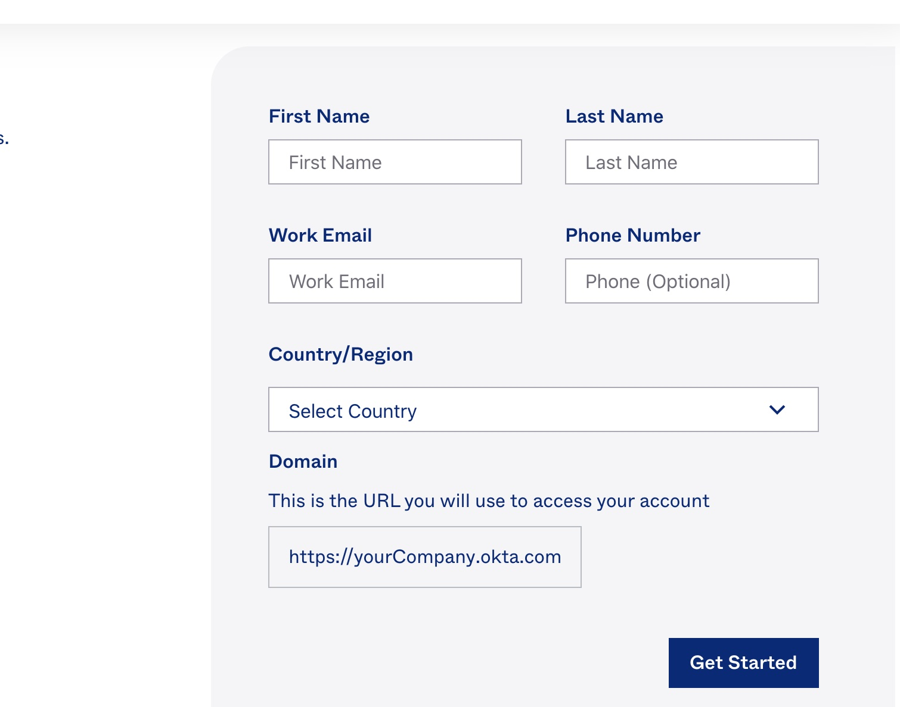

注册成功后，Okta会向您注册的电子邮箱中发送一封电子邮件，邮件中包含登录地址和临时密码，访问登录地址并使用临时密码就可以登录Okta，首次登录时需要修改密码。

使用Okta创建OpenID应用时，需要设置 **Okta Verify** 。

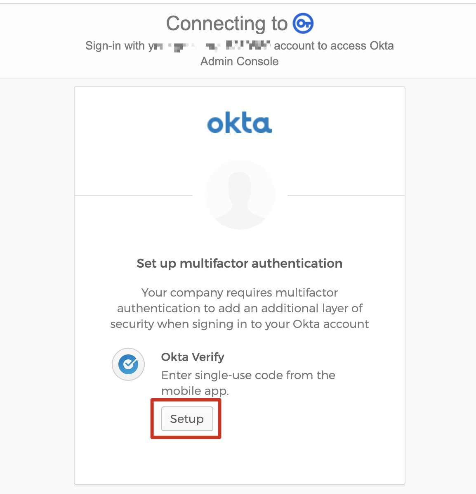

按照提示要求选择您的手机的类型 iPhone/Android, 并按照相关指引下载对应平台的 **Okta Verify** App，下载安装完成后打开Okta Verify App，扫描屏幕上的二维码进行绑定。

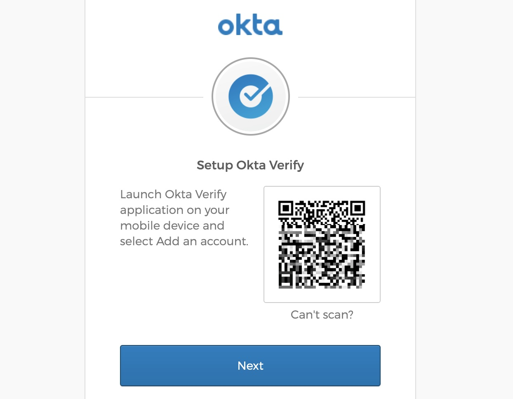

点击下一步，并输入Okta Verify App中显示的您刚才绑定账号的安全码。

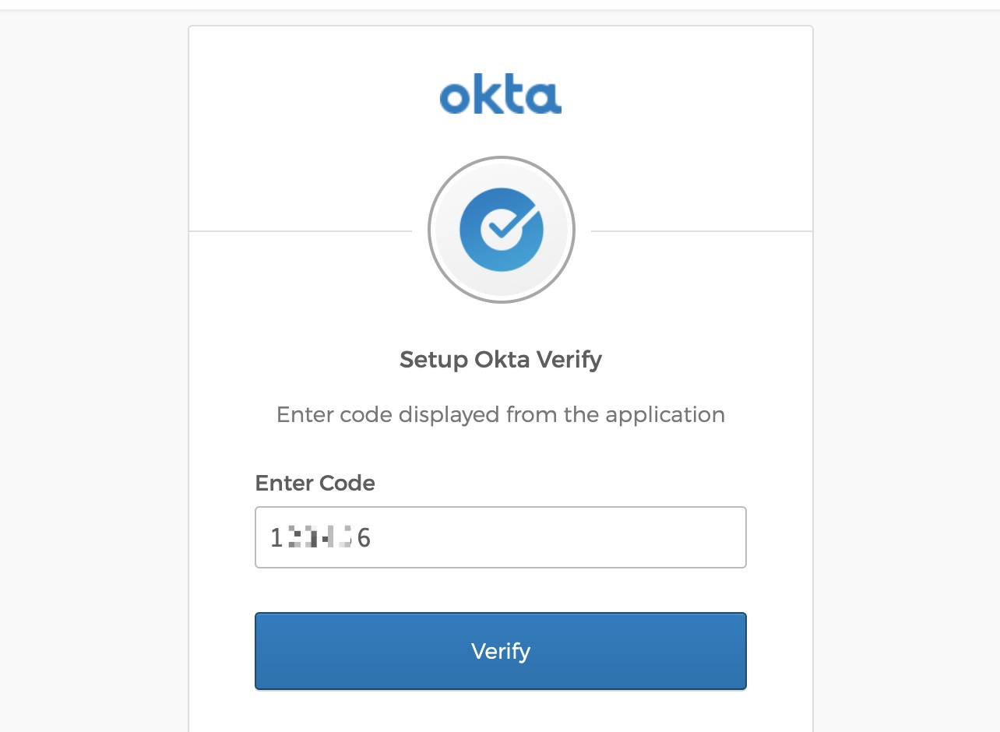

点击 **Verify** 验证。

### 在Okta中创建OpenID应用

登录成功后将跳转到Dashboard页面，在左边菜单栏中依次点击：Applications -> Applications. 或者在Dashboard的 Overview 框中点击  SSO Apps 链接，进入应用管理界面：

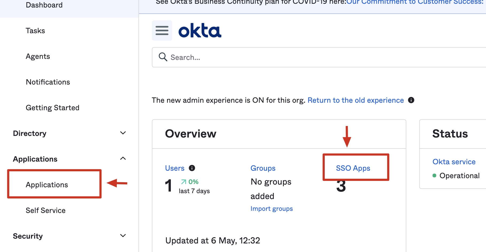

在应用管理界面中点击 **Add Application**：

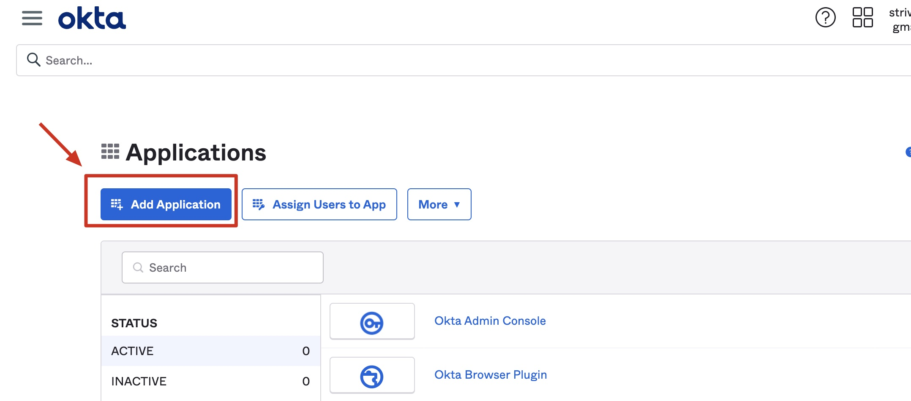

在Add Application界面中点击 **Create New App** 按钮：

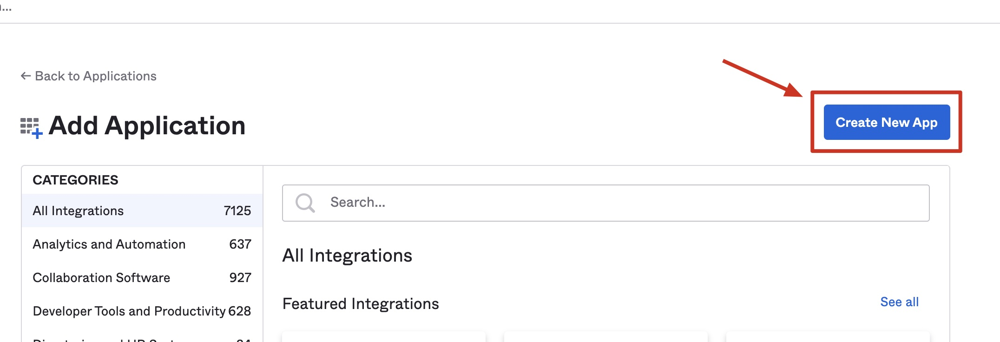

在创建应用的弹出层中，Platform选择 Single Page App(SPA)，Sign on method 选择 OpenID Connect。 点击 **Create** 按钮

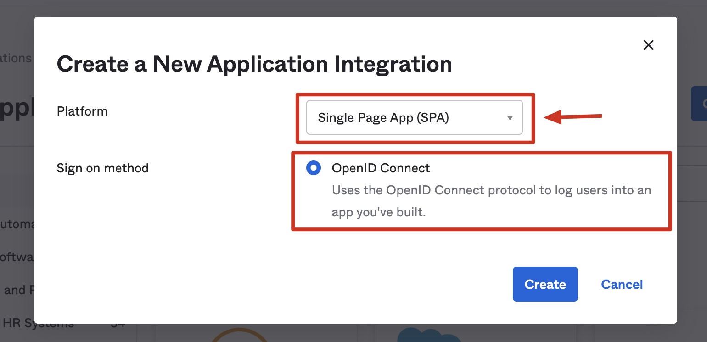

在创建应用表单中填写 Application Name, 以及 Login Redirect URIs（填写格式: https:// 您部署Data Transfer Hub的域名/authentication/callback）, 点击 **Save**

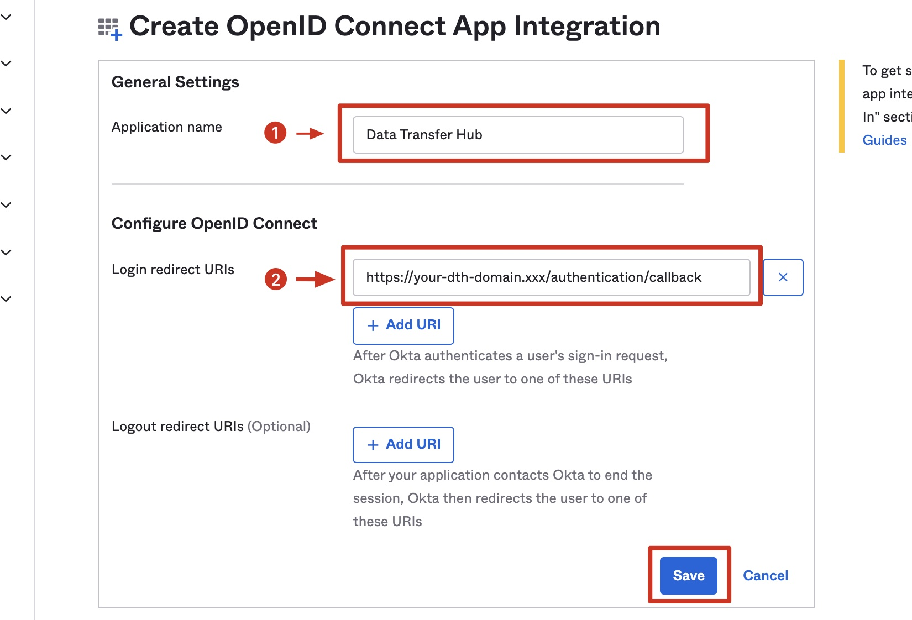

### 在Okta中配置OpenID应用

在应用详情页面中，在General Tab页面中，滑动到General Settings框中，点击右边的 **Edit** 按钮

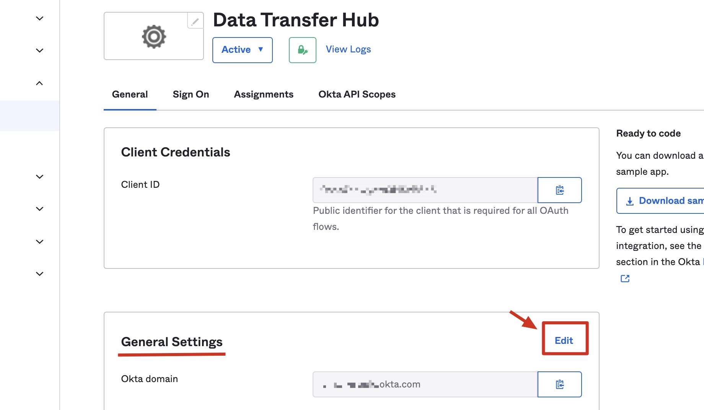

在Application框中的 Allowed grant types 表单中，选中 Authorization Code， Implicit 以及 Allow ID Token with implicit grant type。

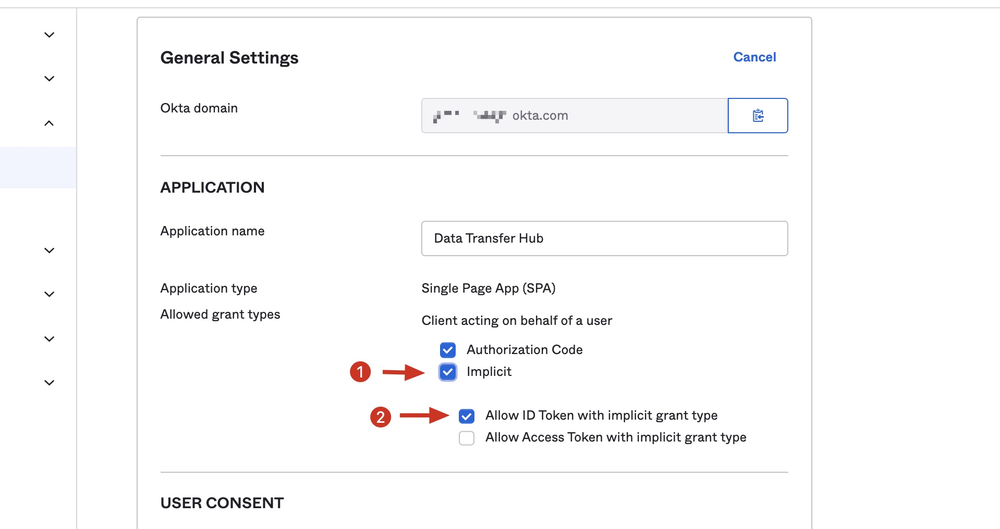

点击页面最下方的 **Save** 按钮保存设置

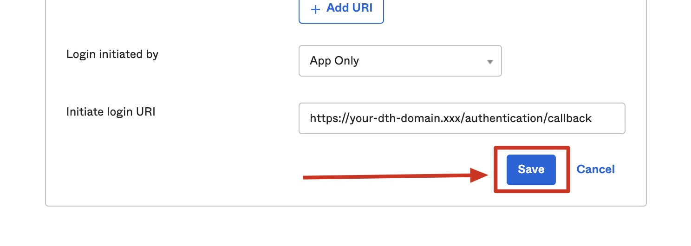

### 在Cloudformation中部署Data Transfer Hub

在部署之前，请将Okta应用中的 General Tab 中的 **Client ID** 和 **Okta Domain** 记录下来，在部署的时候，需要将这两个值填入Cloudformation的部署参数中。

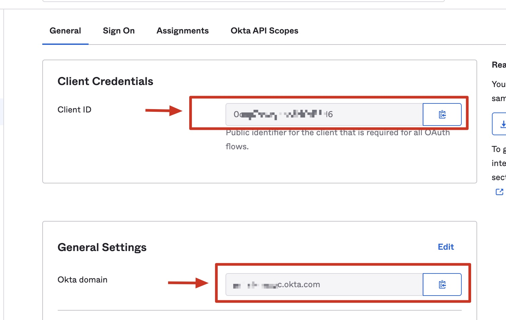

#### 使用 Cloudformation 一键部署 Data Transfer Hub

1. 确保您已经登录到AWS控制台.

    [中国区](https://console.amazonaws.cn/console/home)

    [海外区](https://console.aws.amazon.com/console/home)

2. 单击以下按钮以在您的AWS帐户中启动CloudFormation堆栈.

    中国区

    

    海外区

    

3. 点击 **下一步**

4. 将上面在Okta中记录的 **Client ID** 和 **Okta Domain** 并打开应用配置信息按照下图所示填写在Cloudformation中的OIDC Settings中的参数:

  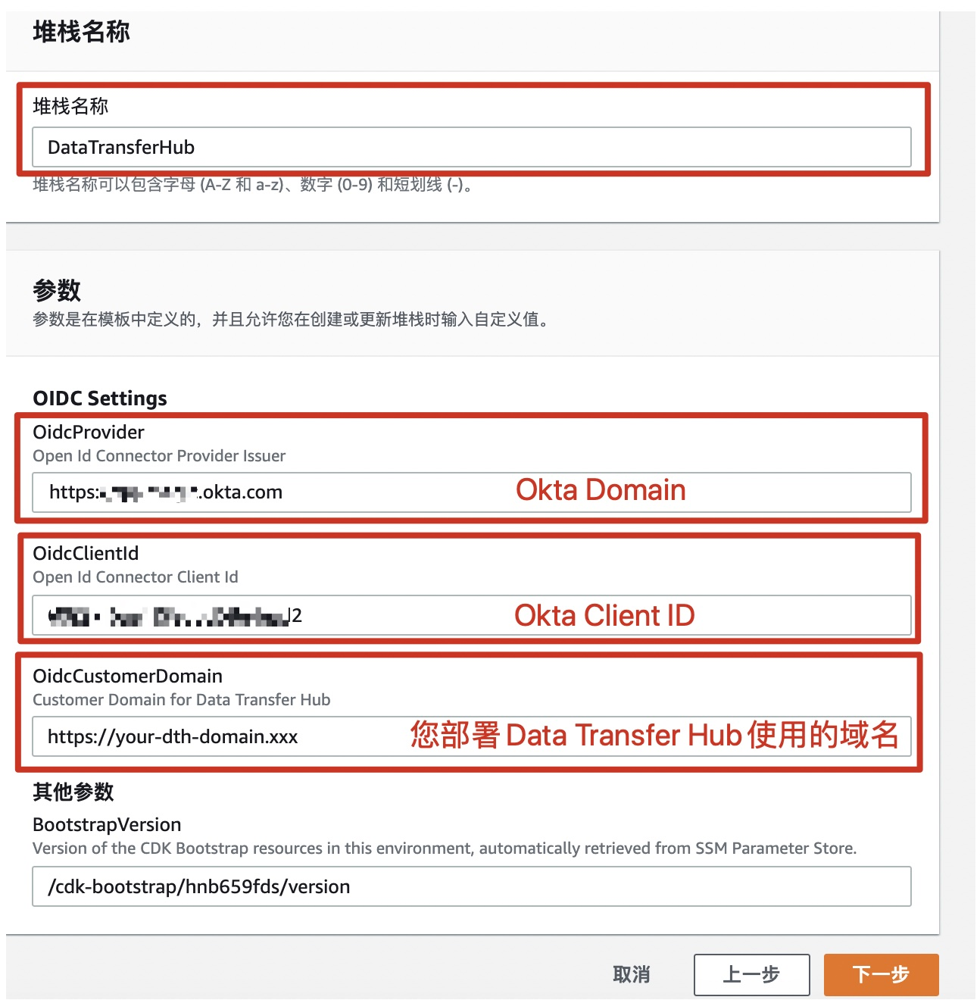
   
5. 点击 **下一步** 保持默认值然后点击 **下一步** 然后点击 **创建堆栈**.

  

至此，在Cloudformation中使用Okta作为用户认证服务部署Data Transfer Hub已经完成。

### 在Route53中配置域名指向CloudFront

在Route 53和ClouFront中，将Route53中的域名增加解析到CloudFront，并在CloudFront中备用域名 (CNAMEs)

1. 在 **Cloudformation** 的输出中找到PortalUrl

   

2. 在 **CloudFront** 中配置您已备案的域名

   

3. 在 **Route 53** 中将您的域名指向CloudFront

   

### 登录Data Transfer Hub

在登录Data Transfer Hub之前，需要将您注册的Okta用户添加到应用进行授权访问

   

在弹出的对话框中，在需要授权的用户右方点击 **Assign**

   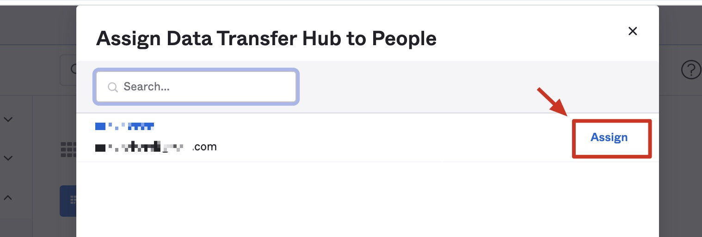

在下一步中，点击 **Save and Go Back** 保存

   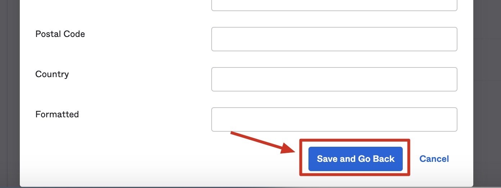

点击 **Done** 或者关闭对话框。 至此，Okta以及用户配置已经完成。

在浏览器中输入您配置的Data Transfer Hub的域名，系统会跳转到Okta登录界面，输入已经授权的账号和密码，点击登录

  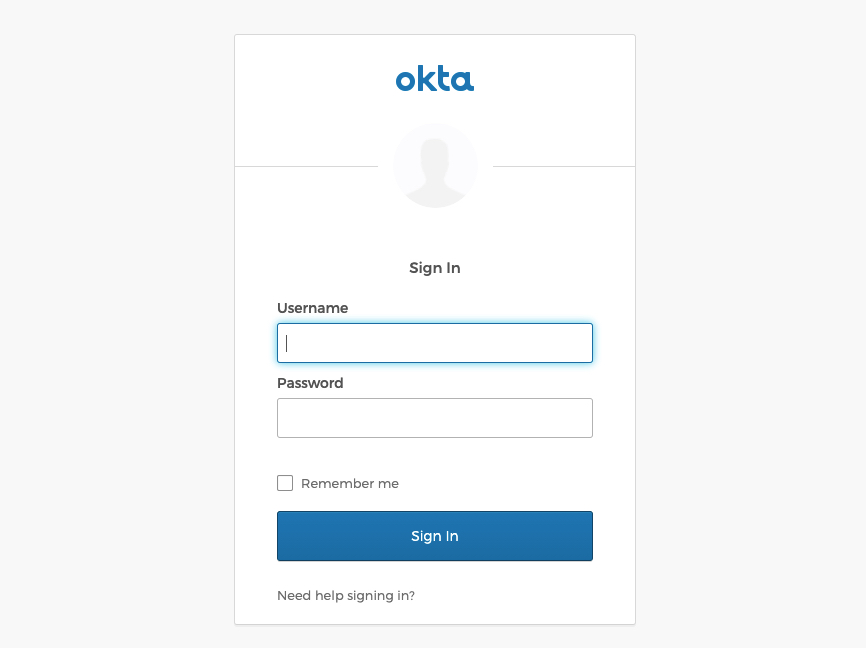

登录成功后，将会跳转到Data Transfer Hub首页，可以开始创建并管理您的迁移任务了。

