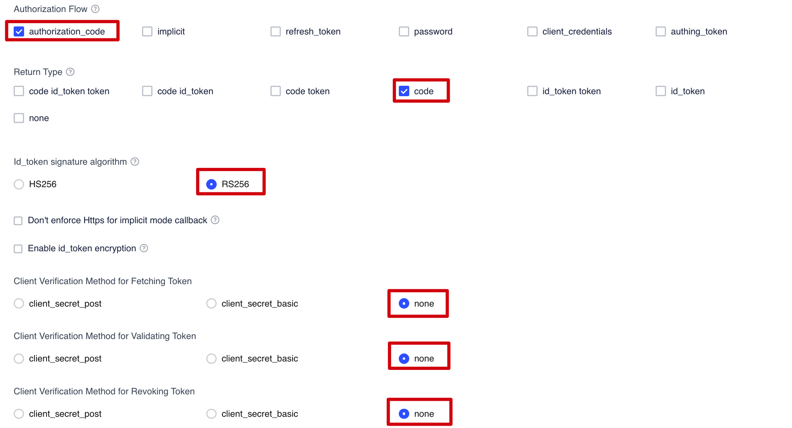

在部署解决方案之前，建议您先查看本指南中有关架构图和区域支持等信息。然后按照下面的说明配置解决方案并将其部署到您的帐户中。

**部署时间**：约15分钟

## 部署步骤

## 步骤1.（选项1）从全球区域启动堆栈 

!!! warning "重要提示"

    以下部署说明仅适用于全球区域。有关中国区域的部署说明，请参阅（选项2）从中国区域部署。

**从全球区域部署AWS CloudFormation模板**

!!! note "注意"

    您需要承担运行数据传输解决方案时使用亚马逊云科技各项服务的成本费用。想要了解详细信息，请参阅本实施指南中的成本章节，以及解决方案中使用的每项服务的定价页面。
 
1. 登录到Amazon Web Services管理控制台，选择按钮以启动 `DataTransferHub-cognito.template` 模板。 您还可以选择直接[下载模板](https://s3.amazonaws.com/solutions-reference/data-transfer-hub/latest/DataTransferHub-cognito.template)进行部署。

    

2. 默认情况下，该模板将在您登录控制台后默认的区域启动，即美国东部（弗吉尼亚北部）区域。若需在指定的区域中启动该解决方案，请在控制台导航栏中的区域下拉列表中选择。

3. 在**创建堆栈**页面上，确认Amazon S3 URL文本框中显示正确的模板URL，然后选择**下一步**。

4. 在**指定堆栈详细信息**页面上，为您的解决方案堆栈分配一个账户内唯一且符合命名要求的名称。有关命名字符限制的信息，请参阅*AWS Identity and Access Management用户指南*中的[IAM 和 AWS STS 配额](https://docs.aws.amazon.com/IAM/latest/UserGuide/reference_iam-limits.html)。
5. 在**参数**部分，查看此解决方案模板的参数并根据需要进行修改。

    | 参数名称 | 默认值 | 描述 |
    |----------|--------|--------|
    | **AdminEmail** | 无|	用于接收临时登录密码的管理员邮箱。

6. 选择**下一步**。

7. 在**配置堆栈选项**页面上，保留默认值并选择**下一步**。

8. 在**审核**页面，查看并确认设置。确保选中确认模板将创建Amazon Identity and Access Management（IAM）资源的复选框。选择**下一步**。

9. 选择**创建堆栈**以部署堆栈。

您可以在Amazon CloudFormation控制台的**状态**列中查看堆栈的状态。正常情况下，大约15分钟内可以看到状态为**CREATE_COMPLETE**。
## 步骤1.（选项2）从中国区域启动堆栈 

!!! warning "重要提示"

    以下部署说明仅适用于中国区域。有关全球区域的部署说明，请参阅（选项1）从全球区域部署。

### 前提条件
1. 创建OIDC用户池。
2. 配置域名服务解析。
3. 确认已有[ICP备案][icp]的域名。

### 前提条件1：创建OIDC用户池
在Amazon Cognito尚不可用的区域，您可以使用OIDC提供身份验证。以下过程以亚马逊云科技合作伙伴[Authing](https://www.authing.cn/)为例，但您也可以选择其它可用的供应商。

1. 登录[Authing 控制台](https://console.authing.cn/console){target=_blank}。
2. 如果您还没有用户池，先创建一个用户池。
3. 选择用户池。
4. 在左侧导航栏，选择**应用**下的**自建应用**。
5. 单击**创建自建应用**按钮。
6. 输入**应用名称**和**认证地址**。
7. 将Endpoint Information中的`App ID`（即`client_id`）和`Issuer`保存到一个文本文件中，以备后面使用。
    

8. 将`Login Callback URL`和`Logout Callback URL`更新为ICP记录的域名。
    

9. 设置以下授权配置。
    

10. 更新登录控制。
    1. 从左侧边栏选择并进入**应用**界面，选择**登录控制**，然后选择**登录注册方式**。
    2. 登录方式请只选择**密码登录：邮箱**。
    3. 请**取消勾选**注册方式方式内的所有选项。
    4. 选择**保存**。

11. 创建管理员用户。
    1. 从左侧边栏选择并进入**用户管理**界面，选择**用户列表**，然后选择**创建用户**。
    2. 选择邮箱模式。
    3. 输入用户的邮箱以及密码。
    4. 根据您的需要勾选`强制用户在首次登录时修改密码`。
    5. 选择**保存**。
    !!! note "注意"
        由于此解决方案不支持应用程序角色，所有用户都将获得管理员权限。

### 前提条件2：配置域名服务解析
配置域名服务 (DNS) 解析以将ICP许可域指向CloudFront默认域名。您也可以使用自己的DNS解析器。

以下示例介绍如何配置Amazon Route 53。

1. 在Amazon Route 53中创建托管区域。有关更多信息，请参阅[Amazon Route 53开发人员指南](https://docs.aws.amazon.com/Route53/latest/DeveloperGuide/Welcome.html)。

2. 为网页控制台URL创建一个CNAME记录。

    1. 从托管区域中，选择**创建记录**。
    1. 在**记录名称**输入框中，输入Host名。
    1. 在**记录类型**中选择**CNAME**。
    1. 在值字段中，输入后续在CloudFormation**部署完成后**，所输出的**PortalUrl**参数。
    1. 选择**创建记录**。

3. 向CloudFront的分配添加备用域名。

    1. 在CloudFront中配置对应的域名，通过在列表中找到PortalURL的分配ID并选择该ID来打开CloudFront控制台。
    1. 点击**编辑**，并将上一步中Route 53的记录添加到`备用域名(CNAME)`中。

**从中国区域部署AWS CloudFormation模板**

此自动化AWS CloudFormation模板从亚马逊云科技中国区域部署数据传输解决方案。启动堆栈之前，请务必完成前提条件。

!!! note "注意"

    您需要承担运行数据传输解决方案时使用亚马逊云科技各项服务的成本费用。想要了解详细信息，请参阅本实施指南中的成本章节，以及解决方案中使用的每项服务的定价页面。

1. 登录到Amazon Web Services管理控制台，选择按钮以启动 `DataTransferHub-openid.template` 模板。您还可以选择直接[下载模板](https://s3.amazonaws.com/solutions-reference/data-transfer-hub/latest/DataTransferHub-openid.template)进行部署。

    

2. 模板将在您的默认区域启动。要在不同的区域中启动解决方案，请使用控制台导航栏中的区域选择器。
3. 在**创建堆栈**页面上，确认Amazon S3 URL文本框中显示正确的模板URL，然后选择**下一步**。
4. 在**指定堆栈详细信息**页面上，为您的解决方案堆栈分配一个账户内唯一且符合命名要求的名称。有关命名字符限制的信息，请参阅*AWS Identity and Access Management用户指南*中的[IAM 和 AWS STS 配额](https://docs.aws.amazon.com/IAM/latest/UserGuide/reference_iam-limits.html)。
5. 在**参数**部分，查看此解决方案模板的参数并根据需要进行修改。

    | 参数名称 | 默认值 | 描述 |
    |----------|--------|--------|
    | **OidcProvider** | 无 |	OIDC应用程序配置中显示的颁发者。
    | **OidcClientId** | 无 |	OIDC应用配置中显示的App ID。
    | **OidcCustomerDomain** | 无 | 指在中国完成ICP注册的客户域，注意不是Authing提供的子域。  它的开头必须是https://。
    | **AdminEmail** | 无 | 用于接收传输任务状态监控的邮箱。

6. 选择**下一步**。
7. 在**配置堆栈选项** 页面上，保持默认值并选择**下一步**。
8. 在查看页面，查看并确认设置。选中确认模板将创建AWS Identity and Access Management (IAM) 资源的框。
9. 选择**创建堆栈**以部署堆栈。

您可以在Amazon CloudFormation控制台的**状态**列中查看堆栈的状态。正常情况下，大约15分钟内可以看到状态为**CREATE_COMPLETE**。

## 步骤2：访问网页控制台 

在堆栈创建成功后，您可在AWS CloudFormation的**输出**标签页中查看访问网页控制台需要的信息（**PortalUrl**）。

成功部署后，包含临时登录密码的电子邮件将发送到提供的电子邮件地址。

根据您启动堆栈的区域情况，您可以选择从中国区域或全球区域访问网页控制台。

- [选项1: 从全球区域使用Amazon Cognito用户池登录](#cognito)
- [选项2: 从中国区域使用OpenID身份验证登录](#openid)

### 选项1: 从全球区域使用Amazon Cognito用户池登录 

1. 在浏览器的地址栏输入PortalURL，然后导航到Amazon Cognito控制台。
2. 使用AdminEmail和临时密码登录。
    1. 设置新的帐户密码。
    2. （可选）验证您的电子邮件地址以恢复帐户。
3. 验证完成后，系统将打开网页控制台。

### 选项2: 从中国区域使用OpenID身份验证登录 
1. 在浏览器的地址栏输入数据传输中心域名。
    - 如果您是第一次登录，系统会打开Authing.cn登录界面。
2. 输入您在部署解决方案时注册的用户名和密码，然后选择登录。系统将打开网页控制台。
3. 更改您的密码，然后重新登录。
## 步骤3：创建数据传输任务 
您可以选择为Amazon S3或Amazon ECR创建传输任务。更多信息请参考[创建Amazon S3传输任务](../user-guide/tutorial-s3.md)和[创建Amazon ECR传输任务](../user-guide/tutorial-ecr.md)。

*网页控制台*

[icp]: https://www.amazonaws.cn/en/support/icp/?nc2=h_l2_su
