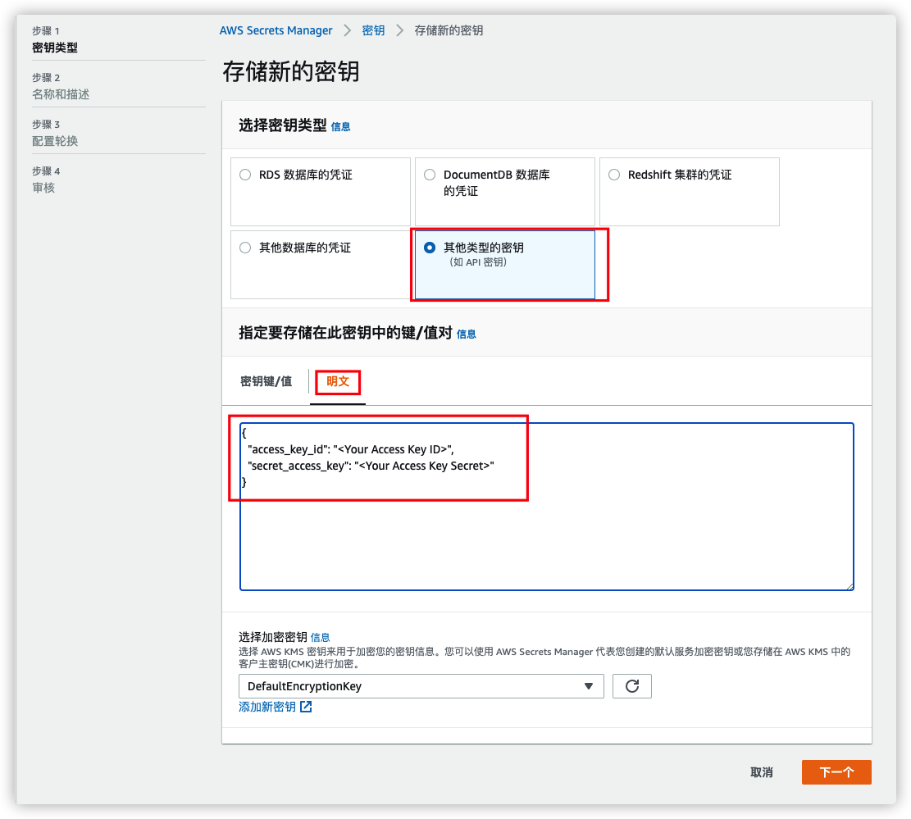

该解决方案允许您通过以下方式创建 Amazon ECR 传输任务：

- 使用控制台传输任务
- 使用 DTH ECR 插件传输任务
- 使用 AWS CLI 创建传输任务

想要了解这几种方式的更多信息，可参考[创建 Amazon S3 传输任务](./tutorial-s3.md)。

## 使用控制台传输任务
您可以在网页控制台创建Amazon ECR数据传输任务。更多信息请参考[部署解决方案](../../deployment/deployment-overview)。

1. 从**创建传输任务**页面，选择**创建新任务**，然后选择**下一步**。
2. 在**引擎选项**页面的引擎下，选择**Amazon ECR**，然后选择**下一步**。您还可以通过选择 **Public Container Registry** 从 Docker Hub，GCR.io，Quay.io 等复制镜像。
3. 指定传输任务详细信息。在**源仓库类型**中，选择容器仓库类型。
4. 在**源仓库设置**中，输入**源仓库区域**和**Amazon Web Services账户ID**。
5. 要创建凭证信息，请选择[Secrets Manager](https://console.aws.amazon.com/secretsmanager/home)以跳转到当前区域的AWS Secrets Manager控制台。

    1. 从左侧菜单中，选择**密钥**，然后选择**储存新的密钥**并选择**其他类型的密钥**类型。
    2. 根据显示格式在Plaintext输入框中填写`access_key_id`和`secret_access_key`信息。有关更多信息，请参阅*IAM用户指南*中的[IAM功能](https://docs.aws.amazon.com/IAM/latest/UserGuide/introduction.html)。选择**下一步**。
    3. （可选）输入密钥名称和描述。选择**下一步**。
    4. 在自动轮换的配置中，选择禁用自动轮换。选择**下一步**。
    5. 保留默认值，选择**保存**完成密钥的创建。

6. 返回任务创建界面并刷新界面。您的新密钥将显示在下拉列表中。

7. 选择证书（密钥）。

    !!! note "注意"

        如果数据源也在方案部署的账户中，您必须为目标端创建或提供凭证信息。否则，您不需要为目标端提供凭证信息。

8. 在**通知邮箱**中提供电子邮件地址。

9. 选择**下一步**并查看您的任务参数详细信息。

10. 选择**创建任务**。

任务创建成功后，会出现在任务页面。

## 使用DTH ECR 插件传输任务

    !!! note "注意"

       本教程是纯后端版本的部署指南。如需了解详情，请参考该[DTH ECR插件介绍](https://github.com/awslabs/data-transfer-hub/blob/main/docs/ECR_PLUGIN_CN.md)。


**1. 准备VPC (可选)**

此解决方案可以部署在公共和私有子网中。 建议使用公共子网。

- 如果您想使用现有的 VPC，请确保 VPC 至少有 2 个子网，并且两个子网都必须具有公网访问权限（带有 Internet 网关的公有子网或带有 NAT 网关的私有子网）

- 如果您想为此解决方案创建新的默认 VPC，请转到步骤2，并确保您在创建集群时选择了*为此集群创建一个新的 VPC*。


**2. 配置ECS集群**

此方案需要ECS 集群才能运行Fargate任务。

打开AWS 管理控制台 > Elastic Container Service (ECS)。 在 ECS集群首页上，单击 **创建集群**

步骤1：选择集群模版，确保选择 **仅限联网** 类型。

步骤2：配置集群，指定集群名称，点击创建即可。 如果您还想创建一个新的 VCP（仅限公有子网），还请选中**为此集群创建新的 VPC** 选项。


**3. 配置凭据**

如果源（或目标）不在当前的AWS账户中，则您需要提供`AccessKeyID`和`SecretAccessKey`（即`AK` / `SK`）以从Amazon ECR中拉取或推送镜像。 Amazon Secrets Manager 用于以安全方式存储访问凭证。

> 注意：如果源类型为“公共（Public）”，则无需提供源的访问凭证。

打开AWS 管理控制台 > Secrets Manager。 在 Secrets Manager 主页上，单击 **存储新的密钥**。 对于密钥类型，请使用**其他类型的秘密**。 对于键/值对，请将下面的 JSON 文本复制并粘贴到明文部分，并相应地将值更改为您的 AK/SK。

```
{
  "access_key_id": "<Your Access Key ID>",
  "secret_access_key": "<Your Access Key Secret>"
}
```



然后下一步指定密钥名称，最后一步点击创建。

**4. 启动AWS Cloudformation部署**

请按照以下步骤通过AWS Cloudformation部署此插件。

1.登录到AWS管理控制台，切换到将CloudFormation Stack部署到的区域。

1.单击以下按钮在该区域中启动CloudFormation堆栈。

  - 部署到AWS中国北京和宁夏区

  [](https://console.amazonaws.cn/cloudformation/home#/stacks/create/template?stackName=DTHECRStack&templateURL=https://solutions-reference.s3.amazonaws.com/data-transfer-hub/latest/DataTransferECRStack.template)

  - 部署到AWS海外区

  [](https://console.aws.amazon.com/cloudformation/home#/stacks/create/template?stackName=DTHECRStack&templateURL=https://solutions-reference.s3.amazonaws.com/data-transfer-hub/latest/DataTransferECRStack.template)

    
1.单击**下一步**。 相应地为参数指定值。 如果需要，请更改堆栈名称。

1.单击**下一步**。 配置其他堆栈选项，例如标签（可选）。

1.单击**下一步**。 查看并勾选确认，然后单击“创建堆栈”开始部署。

部署预计用时3-5分钟

## 使用AWS CLI创建传输任务
您可以使用 [AWS CLI][aws-cli] 创建 Amazon ECR传输任务。如果您同时部署了DTH Portal，通过CLI启动的任务将不会出现在您Portal的任务列表界面中。

1. 创建一个具有两个公有子网或两个拥有[NAT 网关][nat] 私有子网的Amazon VPC。

2. 根据需要替换`<CLOUDFORMATION_URL>`为`https://solutions-reference.s3.amazonaws.com/data-transfer-hub/latest/DataTransferECRStack.template`。

3. 转到您的终端并输入以下命令。详情请参考**参数列表**。

    ```shell
    aws cloudformation create-stack --stack-name dth-ecr-task --template-url CLOUDFORMATION_URL \
    --capabilities CAPABILITY_NAMED_IAM \
    --parameters \
    ParameterKey=sourceType,ParameterValue=Amazon_ECR \
    ParameterKey=srcRegion,ParameterValue=us-east-1 \
    ParameterKey=srcAccountId,ParameterValue=123456789012 \
    ParameterKey=srcList,ParameterValue=ALL \
    ParameterKey=includeUntagged,ParameterValue=false \
    ParameterKey=srcImageList,ParameterValue= \
    ParameterKey=srcCredential,ParameterValue=dev-us-credential \
    ParameterKey=destAccountId,ParameterValue= \
    ParameterKey=destRegion,ParameterValue=us-west-2 \
    ParameterKey=destCredential,ParameterValue= \
    ParameterKey=destPrefix,ParameterValue= \
    ParameterKey=alarmEmail,ParameterValue=your_email@example.com \
    ParameterKey=ecsVpcId,ParameterValue=vpc-07f56e8e21630a2a0 \
    ParameterKey=ecsClusterName,ParameterValue=dth-v22-01-TaskCluster-eHzKkHatj0tN \
    ParameterKey=ecsSubnetA,ParameterValue=subnet-034c58fe0e696eb0b \
    ParameterKey=ecsSubnetB,ParameterValue=subnet-0487ae5a1d3badde7

    ```


**参数列表**

| 参数名称 | 允许值 | 默认值 | 说明 |
| --- | --- | --- | --- |
| sourceType      | Amazon_ECR <br> Public         | Amazon_ECR    | 选择源容器注册表的类型，例如 Amazon_ECR 或来自 Docker Hub、gco.io 等的 Public。 |
| srcRegion       |                                |               | 源区域名称（仅当源类型为 Amazon ECR 时才需要），例如 us-west-1 |
| srcAccountId    |                                |               | 源 AWS 账户 ID（仅当源类型为 Amazon ECR 时才需要），如果源位于当前账户中，则将其留空 |
| srcList         | ALL <br> SELECTED              | ALL           | 源图像列表的类型，全部或选定的，对于公共注册表，请仅使用选定的 |
| srcImageList    |                                |               | 所选镜像列表以逗号分隔，例如 ubuntu:latest,alpine:latest...，如果 Type 为 ALL，则将其留空。 对于ECR源，使用ALL_TAGS标签来获取所有标签。|
| srcCredential   |                                |               | 仅当使用 AK/SK 凭证从源 Amazon ECR 提取映像时，Secrets Manager 中的密钥名称，对于公共注册表将其留空 |
| destRegion      |                                |               | 目标区域名称，例如 cn-north-1 |
| destAccountId   |                                |               | 目标 AWS 账户 ID，如果目标位于当前账户中，则将其留空 |
| destPrefix      |                                |               | Destination Repo Prefix |
| destCredential  |                                |               | 仅当使用 AK/SK 凭证将映像推送到目标 Amazon ECR 时，Secrets Manager 中的密钥名称|
| includeUntagged | true <br> false                | true          | 是否在复制中包含未标记的图像 |
| ecsClusterName  |                                |               | 运行ECS任务的ECS集群名称（请确保集群存在）|
| ecsVpcId        |                                |               | 用于运行 ECS 任务的 VPC ID，例如 vpc-bef13dc7 |
| ecsSubnetA      |                                |               | 运行 ECS 任务的第一个子网 ID，例如 子网-97bfc4cd |
| ecsSubnetB      |                                |               | 运行 ECS 任务的第二个子网 ID，例如 子网-7ad7de32 |
| alarmEmail      |                                |               | 发生任何故障时接收通知的警报电子邮件地址 |


[aws-cli]: https://aws.amazon.com/cli/
[nat]: https://docs.aws.amazon.com/vpc/latest/userguide/vpc-nat-gateway.html

[iam-role]: https://us-east-1.console.aws.amazon.com/iamv2/home#/roles